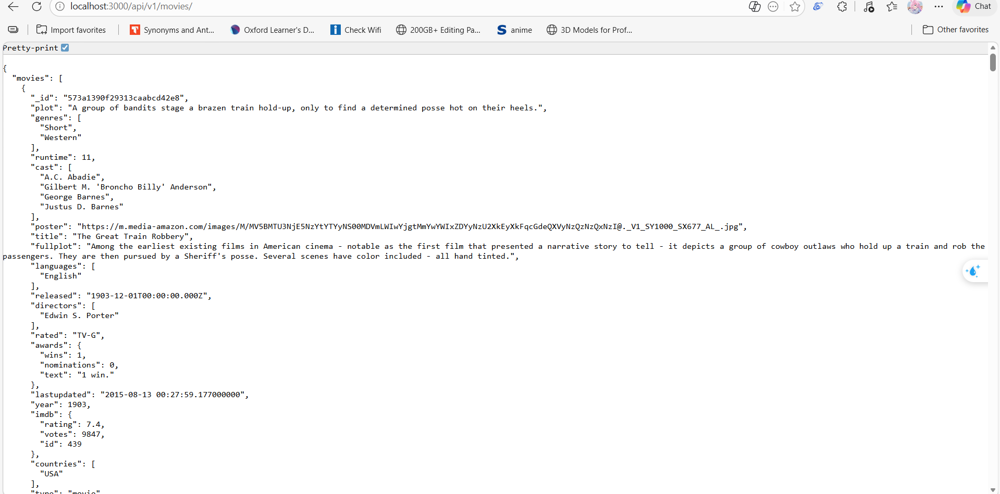

**Mục tiêu bài thực hành**
- Thiết lập backend cho ứng dụng Movie bằng Node.js và ExpressJS.
- Kết nối backend tới MongoDB Atlas.
- Xây dựng API cơ bản theo luồng Route -> Controller -> DAO để truy xuất dữ liệu phim.

**Công cụ / Môi trường sử dụng**
- Node.js.
- Trình soạn thảo mã nguồn: Visual Studio Code (hoặc công cụ tương đương).
- Dependency chính: `express`, `cors`, `dotenv`, `mongodb`.
- Công cụ hỗ trợ chạy phát triển: `nodemon`.
- Cơ sở dữ liệu: MongoDB Atlas Cloud.

**Cách chạy**
- **Bước 1:** Tạo thư mục dự án `movie-reviews/backend` và khởi tạo npm bằng `npm init`.
- **Bước 2:** Cài package cần thiết bằng `npm install express cors dotenv mongodb`.
- **Bước 3:** Cài `nodemon` để tự động restart server khi code thay đổi.
- **Bước 4:** Tạo các file chính:
	- `server.js` để khởi tạo Express app và middleware.
	- `.env` để cấu hình `MOVIEREVIEWS_DB_URI`, `MOVIEREVIEWS_NS`, `PORT`.
	- `index.js` để kết nối MongoDB Atlas và chạy server.
	- `api/movies.route.js` để định tuyến API.
	- `dao/moviesDAO.js` để truy xuất dữ liệu collection `movies`.
	- `api/movies.controller.js` để nhận request và trả response.
- **Bước 5:** Chạy backend bằng `npm run dev` hoặc `node index.js`.
- **Bước 6:** Truy cập `http://localhost:3000/api/v1/movies` để kiểm tra kết quả.

**Kết quả đầu ra (mong đợi)**
- Backend chạy thành công trên cổng được cấu hình (ví dụ `3000`).
- API `GET /api/v1/movies` trả dữ liệu JSON.
- Hoàn thiện cấu trúc backend theo mô hình tách lớp:
	- route xử lý định tuyến.
	- controller xử lý request/response.
	- DAO thao tác truy xuất dữ liệu MongoDB.

**Các phần chính đã thực hiện**
- **Khởi tạo server:** Dùng Express, bật `cors` và parse JSON.
- **Kết nối cơ sở dữ liệu:** Dùng MongoClient với URI trong `.env` để kết nối MongoDB Atlas.
- **Thiết lập DAO:**
	- `injectDB()` nhận kết nối và lấy collection `movies`.
	- `getMovies()` trả về `moviesList` và `totalNumMovies` với mặc định `filters = null`, `page = 0`, `moviesPerPage = 20`.
- **Thiết lập Controller:** Nhận request từ route, gọi DAO để lấy dữ liệu, trả JSON cho client.
- **Thiết lập Routing:** Ánh xạ endpoint `/api/v1/movies` vào controller.

**Hình ảnh minh họa**

**Bài 1 — Chuẩn bị môi trường**

**Bài 2 — Xây dựng backend và API**

