# IE213 — Thực hành Kỹ thuật phát triển hệ thống Web

**Thông tin sinh viên**
- **Họ và tên:** Nguyễn Thanh Trí
- **MSSV:** 23521645
- **Lớp:** IE213.Q21

**Môn học**
- IE213.Q21 — Kỹ thuật phát triển hệ thống Web

**Cấu trúc thư mục**
```
23521645-NguyenThanhTri-IE213.Q21/   # root của repository bài lab
├─ Lab01/                    # Lab01
│  ├─ images/                # hình ảnh minh họa kết quả Lab01
│  ├─ lab01.js               # lệnh mẫu để chạy trong mongosh
│  └─ README.md              # hướng dẫn chi tiết Lab01
├─ Lab02/                    # Lab02
│  ├─ images/                # hình ảnh minh họa kết quả Lab02
│  ├─ movie-reviews/
│  │  └─ backend/
│  │     ├─ .env
│  │     ├─ index.js
│  │     ├─ server.js
│  │     ├─ package.json
│  │     ├─ package-lock.json
│  │     ├─ api/
│  │     │  ├─ movies.route.js
│  │     │  └─ movies.controller.js
│  │     └─ dao/
│  │        └─ moviesDAO.js
│  └─ README.md              # hướng dẫn chi tiết Lab02
├─ Lab03/                    # Lab03
│  ├─ images/                # hình ảnh minh họa kết quả Lab03
│  ├─ movie-reviews/
│  │  └─ backend/
│  │     ├─ .env
│  │     ├─ index.js
│  │     ├─ server.js
│  │     ├─ package.json
│  │     ├─ api/
│  │     └─ dao/
│  └─ README.md              # hướng dẫn chi tiết Lab03
├─ Lab04/                    # Lab04
├─ Lab05/                    # Lab05
├─ Lab06/                    # Lab06
└─ README.md                 # README chính (mục lục + hướng dẫn chung)
```

**Danh sách các lab & mô tả ngắn**
- Lab01 — Thiết lập môi trường MongoDB Atlas + thao tác cơ bản với `employees` collection (CRUD, Index, Aggregation)
- Lab02 — Thiết lập môi trường Node.js và xây dựng backend `movie-reviews` với API cơ bản theo mô hình Route -> Controller -> DAO.
- Lab03 — Hoàn thiện backend `movie-reviews` với review CRUD, lấy phim theo ID kèm review và tra cứu danh sách rating.
- Lab04 — (Chưa có)
- Lab05 — (Chưa có)
- Lab06 — (Chưa có)

**Cách chạy Lab01**

**Bài 1:**
1. Đăng ký tài khoản MongoDB Atlas và tạo cluster mới.
2. Kết nối MongoDB Compass với cluster vừa tạo trên MongoDB Atlas.

**Bài 2:**
1. Mở công cụ **Mongosh** trong MongoDB Compass.
2. Chạy lần lượt các lệnh trong `lab01.js` để thực hiện các yêu cầu của bài tập.

**Kết quả thực hiện**

**Bài 1:**
- Đăng ký thành công tài khoản MongoDB Atlas và tạo cluster.
- Kết nối thành công MongoDB Compass với cluster trên MongoDB Atlas.

**Bài 2:**
- Tạo database `23521645-IE213`.
- Collection `employees` chứa các document mẫu (id, name, age, ...).
- Index `unique` trên trường `id` — ngăn chặn chèn trùng id.
- Kết quả truy vấn `find()` trả về các document phù hợp với điều kiện lọc.
- Kết quả `aggregate()` trả về `totalAge` và `avgAge` theo từng `organization`.

**Hình ảnh minh họa kết quả và testcase**

**Bài 1**


**Bài 2 — Các bước thực hiện**

**2.1 — Tạo database MSSV-IE213**

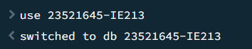

**2.2 — Thêm documents**

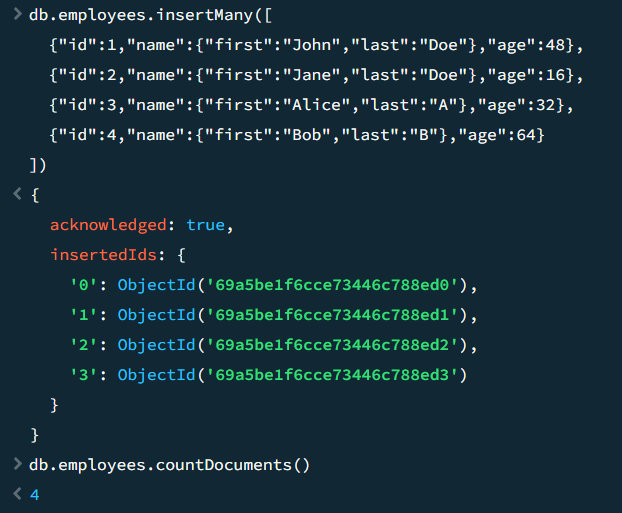

**2.3 — Tạo index `unique` cho trường `id`**

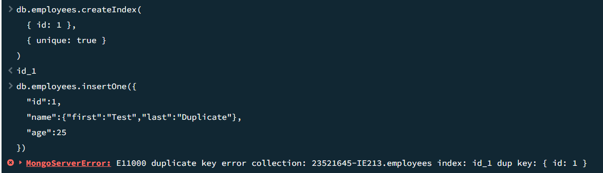

**2.4 — Tìm document của `John Doe`**

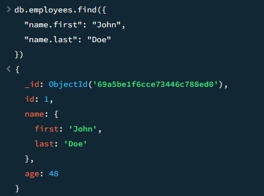

**2.5 — Tìm nhân viên có tuổi trong khoảng (30, 60)**

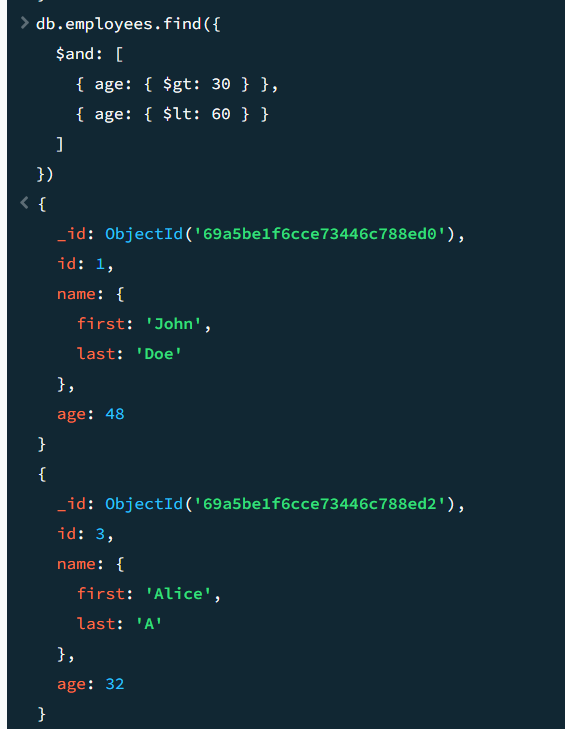

**2.6 — Thêm documents có trường `middle` name (hàm) và testcase**

Chức năng:

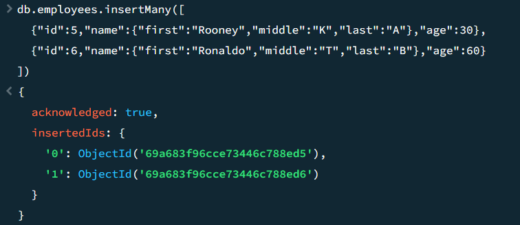

Testcase:

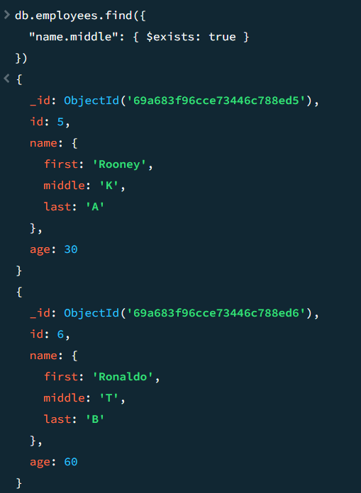

**2.7 — Xóa trường `middle` name**

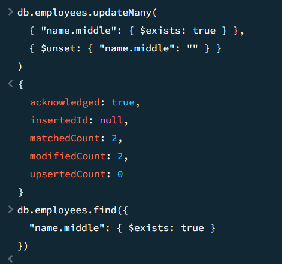

**2.8 — Thêm trường `organization: "UIT"` cho tất cả nhân viên**

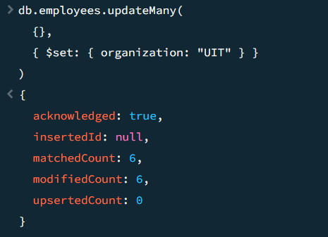

**2.9 — Cập nhật `organization` thành `"USSH"` cho id 5 và id 6**

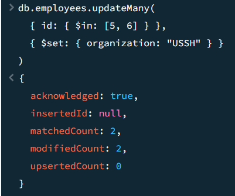

**2.10 — Aggregation tính tổng và trung bình tuổi theo tổ chức**

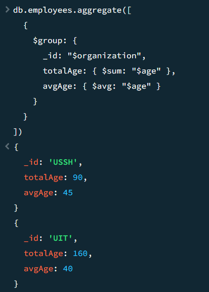

**Kết quả cuối cùng**

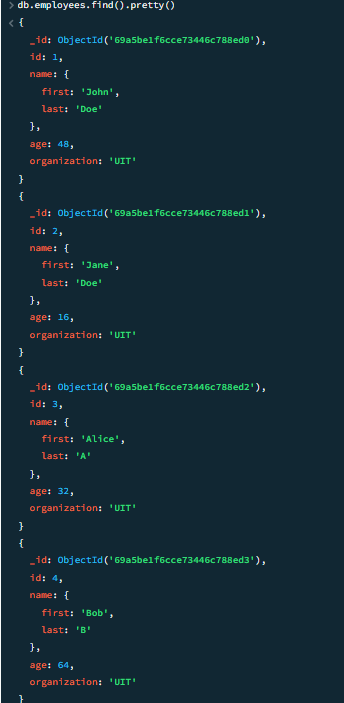

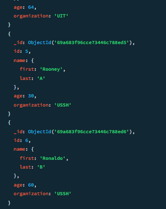

**Lab02 — Thiết lập Backend `movie-reviews`**

**Mục tiêu bài thực hành**
- Thiết lập hệ thống backend cho ứng dụng web bằng Node.js và ExpressJS.
- Kết nối ứng dụng với MongoDB Atlas.
- Xây dựng API cơ bản để truy xuất dữ liệu phim theo kiến trúc Route -> Controller -> DAO.

**Công cụ / môi trường sử dụng**
- Node.js.
- Trình soạn thảo mã nguồn: Visual Studio Code.
- Các dependency chính: `express`, `cors`, `dotenv`, `mongodb`.
- Công cụ hỗ trợ: `nodemon`.
- Cơ sở dữ liệu: MongoDB Atlas Cloud.

**Cách chạy**
- Bước 1: Vào thư mục `Lab02/movie-reviews/backend`.
- Bước 2: Cài dependencies bằng `npm install`.
- Bước 3: Cấu hình biến môi trường trong `.env` (URI kết nối, namespace DB, cổng chạy).
- Bước 4: Chạy server bằng `npm run dev` (hoặc `node index.js`).
- Bước 5: Mở trình duyệt tại `http://localhost:3000/api/v1/movies` để kiểm tra API.

**Kết quả đầu ra**
- Server backend chạy thành công trên cổng cấu hình (mặc định 3000).
- Endpoint `api/v1/movies` trả về JSON.
- Hoàn thiện các thành phần chính của backend:
  - `server.js` để khởi tạo app và middleware.
  - `index.js` để kết nối MongoDB và chạy server.
  - `api/movies.route.js` để định tuyến.
  - `dao/moviesDAO.js` để truy xuất dữ liệu collection `movies`.
  - `api/movies.controller.js` để xử lý request/response.

**Giải thích ngắn gọn phần chính đã thực hiện**
- Khởi tạo server bằng Express, bật middleware `cors` và `express.json()`.
- Tách cấu hình môi trường bằng `.env` để quản lý URI DB, namespace và PORT.
- Kết nối MongoDB Atlas bằng MongoClient trong `index.js`.
- Xây dựng lớp `MoviesDAO` với 2 phương thức chính:
  - `injectDB()` để lấy tham chiếu collection `movies`.
  - `getMovies()` để lấy danh sách phim theo phân trang/lọc và tổng số phim.
- Tạo controller để gọi DAO và trả dữ liệu JSON cho client.
- Gắn controller vào route `/api/v1/movies` để hoàn tất luồng API.

**Hình ảnh minh họa kết quả**

**Bài 1 — Chuẩn bị môi trường**

**1.1 — Tải và cài đặt Node.js (`nodejs.org`)**

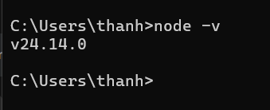

**1.2 — Cài đặt công cụ soạn thảo và quản lý mã nguồn**


**1.3 — Khởi tạo cây thư mục mã nguồn dự án**


**1.4 — Khởi tạo dự án với lệnh `npm init`**


**1.5 — Cài đặt dependency (`mongodb`, `express`, `cors`, `dotenv`)**


**1.6 — Cài đặt `nodemon` để tự động restart khi mã nguồn thay đổi**


**Bài 2 — Xây dựng backend**

**2.1 — Tạo tệp `server.js`**


**2.2 — Tạo tệp `.env`**


**2.3 — Tạo tệp `index.js`**


**2.4 — Tạo route `api/movies.route.js`**


**2.4.1 — Kết quả endpoint trên browser**


**2.5 — Thiết lập DAO `moviesDAO.js`**


**2.5.1 — Gọi `MoviesDAO.injectDB()` trong `index.js`**


**2.6 — Thiết lập controller `movies.controller.js`**


**2.7 — Đưa controller vào định tuyến**


**2.8 — Kết quả cuối trên browser**


**Lab03 — Hoàn thiện Back-end cho ứng dụng minh họa**

**Mục tiêu bài thực hành**
- Hoàn thiện backend cho ứng dụng Movie Reviews theo mô hình Route -> Controller -> DAO.
- Bổ sung chức năng review CRUD, tra cứu phim theo ID kèm review và lấy danh sách rating.
- Kiểm thử toàn bộ API bằng Insomnia.

**Công cụ / môi trường sử dụng**
- Node.js và JavaScript ES6.
- Trình soạn thảo mã nguồn: Visual Studio Code.
- Thư viện chính: `express`, `cors`, `dotenv`, `mongodb`, `nodemon`.
- Cơ sở dữ liệu: MongoDB Atlas Cloud.
- Công cụ kiểm thử API: Insomnia.

**Cách chạy**
- Bước 1: Vào thư mục `Lab03/movie-reviews/backend`.
- Bước 2: Cài dependencies bằng `npm install`.
- Bước 3: Cấu hình file `.env` với `MOVIEREVIEWS_DB_URI`, `MOVIEREVIEWS_NS`, `PORT`.
- Bước 4: Chạy server bằng `npm run dev` hoặc `node index.js`.
- Bước 5: Kiểm thử các endpoint sau bằng Insomnia:
  - `GET /api/v1/movies`
  - `GET /api/v1/movies/id/:id`
  - `GET /api/v1/movies/ratings`
  - `POST /api/v1/movies/review`
  - `PUT /api/v1/movies/review`
  - `DELETE /api/v1/movies/review`

**Kết quả đầu ra**
- Backend chạy thành công trên cổng cấu hình.
- API trả được danh sách phim, phim theo ID kèm review, và danh sách rating.
- Thêm, sửa, xóa review hoạt động qua endpoint `/api/v1/movies/review`.

**Giải thích ngắn gọn phần chính đã thực hiện**
- **Routing:** Dùng `express.Router()` để định tuyến request đến đúng controller.
- **Controller:** Nhận dữ liệu từ `req.body` hoặc `req.params`, gọi DAO và trả JSON cho client.
- **DAO:** Thao tác trực tiếp với MongoDB bằng `insertOne`, `updateOne`, `deleteOne`, `aggregate` và `distinct`.
- **Tra cứu nâng cao:** Dùng `$lookup` để lấy phim kèm các review liên quan, và `distinct("rated")` để lấy danh sách rating.

**Hình ảnh minh họa kết quả**

**Bài 1 — Thiết lập định tuyến cho review**


**Bài 2 — Thiết lập Controller cho review**


**Bài 3 — Thiết lập DAO cho reviews**


**3.6 — Thử nghiệm các API thêm / xóa / sửa dữ liệu**


**Bài 4 — Hoàn thành back-end cho ứng dụng minh họa**

**4.1 — Thêm định tuyến lấy phim theo Id kèm review và lấy rating**


**4.2 — Thêm controller `apiGetMovieById()` và `apiGetRatings()`**


**4.3 — Thêm DAO `getMovieById()` và `getRatings()`**


**4.4 — Thử nghiệm các API vừa tạo**


**Những nội dung đã hoàn thành & chưa hoàn thành**
- Hoàn thành: Lab01, Lab02, Lab03.
- Chưa hoàn thành: Lab04, Lab05, Lab06.

**Sử dụng công cụ AI**
Các công cụ AI được sử dụng trong quá trình soạn thảo và hoàn thiện tài liệu này:

- **GitHub Copilot**
  - Mục đích sử dụng: Hỗ trợ chỉnh sửa code, đề xuất cách cấu trúc lại thư mục, và gợi ý đổi tên/đường dẫn ảnh khi di chuyển file.
  - Phần được AI hỗ trợ: Chỉnh sửa/sắp xếp `images` `README.md`, tối ưu cấu trúc thư mục, sửa đường dẫn ảnh và tên file hình ảnh cho rõ nghĩa.

- **Gemini**
  - Mục đích sử dụng: Tra cứu tài liệu, tham khảo cú pháp MongoDB, Node.js, xây dựng testcase và giải thích lỗi khi chạy lệnh.
  - Phần được AI hỗ trợ: Đối chiếu cú pháp lệnh MongoDB, soạn testcase kiểm thử, phân tích nguyên nhân lỗi và đề xuất hướng khắc phục.
