# IE213 — Thực hành Kỹ thuật phát triển hệ thống Web

**Thông tin sinh viên**
- **Họ và tên:** Nguyễn Thanh Trí
- **MSSV:** 23521645
- **Lớp:** IE213.Q21

**Môn học**
- IE213.Q21 — Kỹ thuật phát triển hệ thống Web

**Cấu trúc thư mục**
```
23521645-NguyenThanhTri-IE213.Q21/   # root của repository bài lab
├─ Lab01/                    # Lab01
│  ├─ images/                # hình ảnh minh họa kết quả Lab01
│  ├─ lab01.js               # lệnh mẫu để chạy trong mongosh
│  └─ README.md              # hướng dẫn chi tiết Lab01
├─ Lab02/                    # Lab02
│  ├─ images/                # hình ảnh minh họa kết quả Lab02
│  ├─ movie-reviews/
│  │  └─ backend/
│  │     ├─ .env
│  │     ├─ index.js
│  │     ├─ server.js
│  │     ├─ package.json
│  │     ├─ package-lock.json
│  │     ├─ api/
│  │     │  ├─ movies.route.js
│  │     │  └─ movies.controller.js
│  │     └─ dao/
│  │        └─ moviesDAO.js
│  └─ README.md              # hướng dẫn chi tiết Lab02
├─ Lab03/                    # Lab03
│  ├─ images/                # hình ảnh minh họa kết quả Lab03
│  ├─ movie-reviews/
│  │  └─ backend/
│  │     ├─ .env
│  │     ├─ index.js
│  │     ├─ server.js
│  │     ├─ package.json
│  │     ├─ api/
│  │     └─ dao/
│  └─ README.md              # hướng dẫn chi tiết Lab03
├─ Lab04/                    # Lab04
│  ├─ images/                # hình ảnh minh họa kết quả Lab04
│  └─ movie-reviews/
│     ├─ frontend/           # ReactJS Frontend
│     │  ├─ src/
│     │  │  ├─ Components/    # Các thành phần giao diện
│     │  │  └─ App.js         # Luồng chính và Router
│     │  └─ package.json
│     └─ README.md           # hướng dẫn chi tiết Lab04
├─ Lab05/                    # Lab05
│  ├─ images/                # hình ảnh minh họa kết quả Lab05
│  └─ movie-reviews/
│     ├─ backend/            # Backend API Movie Reviews
│     └─ frontend/           # Frontend ReactJS Movie Reviews
│        ├─ src/
│        └─ package.json
│  └─ README.md              # hướng dẫn chi tiết Lab05
├─ Lab06/                    # Lab06
└─ README.md                 # README chính (mục lục + hướng dẫn chung)
```

**Danh sách các lab & mô tả ngắn**
- Lab01 — Thiết lập môi trường MongoDB Atlas + thao tác cơ bản với `employees` collection (CRUD, Index, Aggregation)
- Lab02 — Thiết lập môi trường Node.js và xây dựng backend `movie-reviews` với API cơ bản theo mô hình Route -> Controller -> DAO.
- Lab03 — Hoàn thiện backend `movie-reviews` với review CRUD, lấy phim theo ID kèm review và tra cứu danh sách rating.
- Lab04 — Thiết lập Frontend cho ứng dụng `movie-reviews` với ReactJS, xây dựng Navbar và hệ thống định tuyến (Routing).
- Lab05 — Xây dựng frontend `movie-reviews` với ReactJS, kết nối backend bằng `axios`, hiển thị chi tiết phim và danh sách review.
- Lab06 — (Chưa có)

**Cách chạy Lab01**

**Bài 1:**
1. Đăng ký tài khoản MongoDB Atlas và tạo cluster mới.
2. Kết nối MongoDB Compass với cluster vừa tạo trên MongoDB Atlas.

**Bài 2:**
1. Mở công cụ **Mongosh** trong MongoDB Compass.
2. Chạy lần lượt các lệnh trong `lab01.js` để thực hiện các yêu cầu của bài tập.

**Kết quả thực hiện**

**Bài 1:**
- Đăng ký thành công tài khoản MongoDB Atlas và tạo cluster.
- Kết nối thành công MongoDB Compass với cluster trên MongoDB Atlas.

**Bài 2:**
- Tạo database `23521645-IE213`.
- Collection `employees` chứa các document mẫu (id, name, age, ...).
- Index `unique` trên trường `id` — ngăn chặn chèn trùng id.
- Kết quả truy vấn `find()` trả về các document phù hợp với điều kiện lọc.
- Kết quả `aggregate()` trả về `totalAge` và `avgAge` theo từng `organization`.

**Hình ảnh minh họa kết quả và testcase**

**Bài 1**

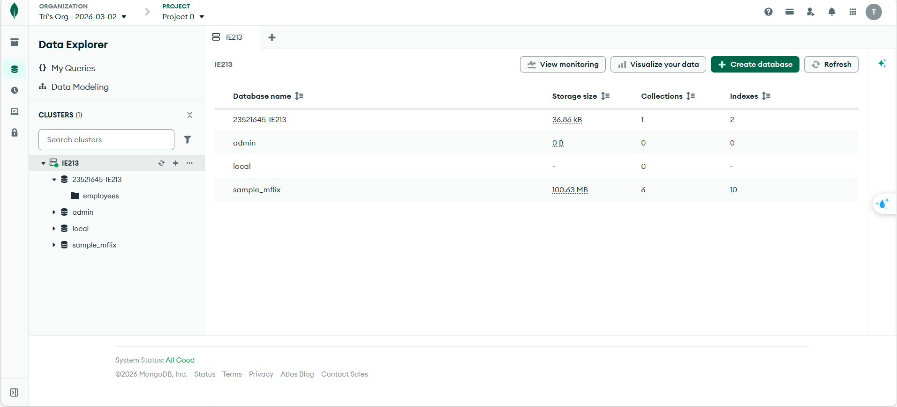

**1.2 — Cài đặt công cụ soạn thảo và quản lý mã nguồn**

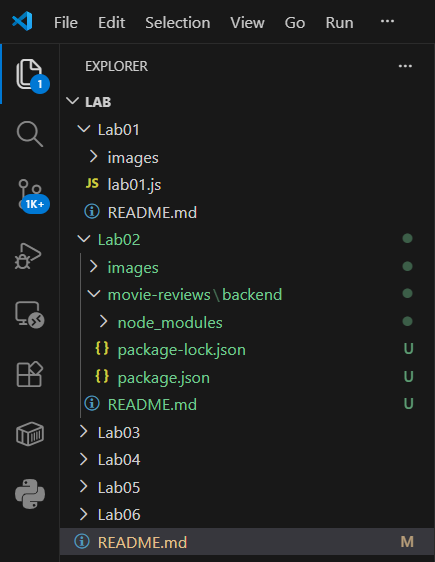

**1.3 — Khởi tạo cây thư mục mã nguồn dự án**

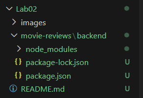

**1.4 — Khởi tạo dự án với lệnh `npm init`**

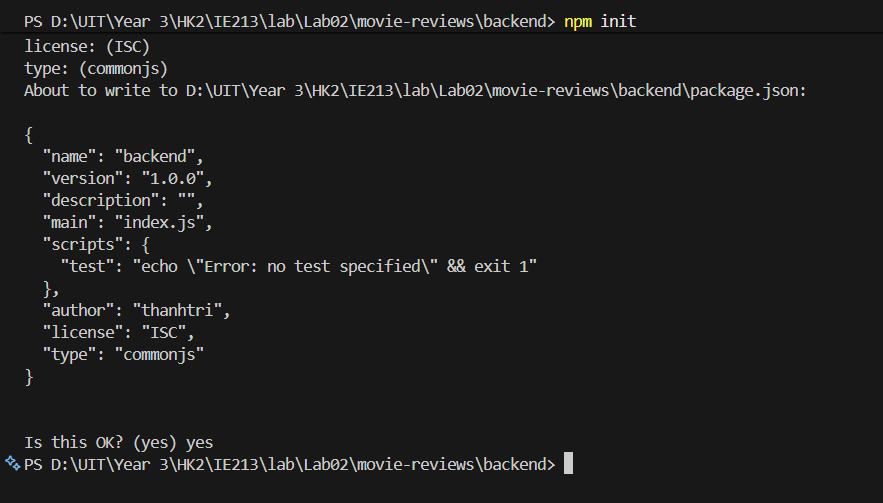

**1.5 — Cài đặt dependency (`mongodb`, `express`, `cors`, `dotenv`)**

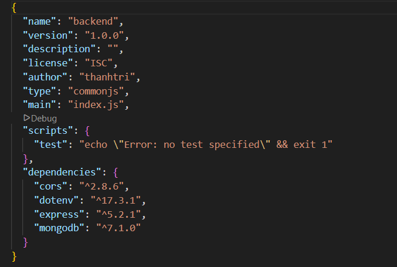

**1.6 — Cài đặt `nodemon` để tự động restart khi mã nguồn thay đổi**

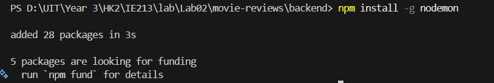

**Bài 2 — Xây dựng backend**

**2.1 — Tạo tệp `server.js`**

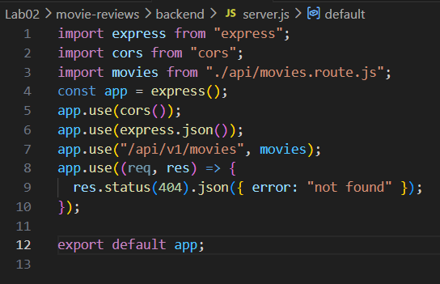

**2.2 — Tạo tệp `.env`**

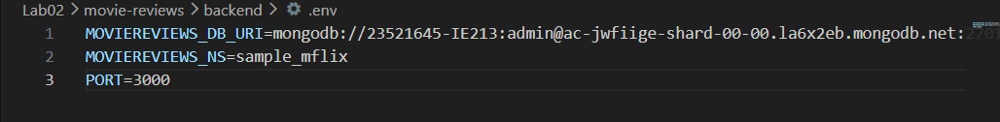

**2.3 — Tạo tệp `index.js`**

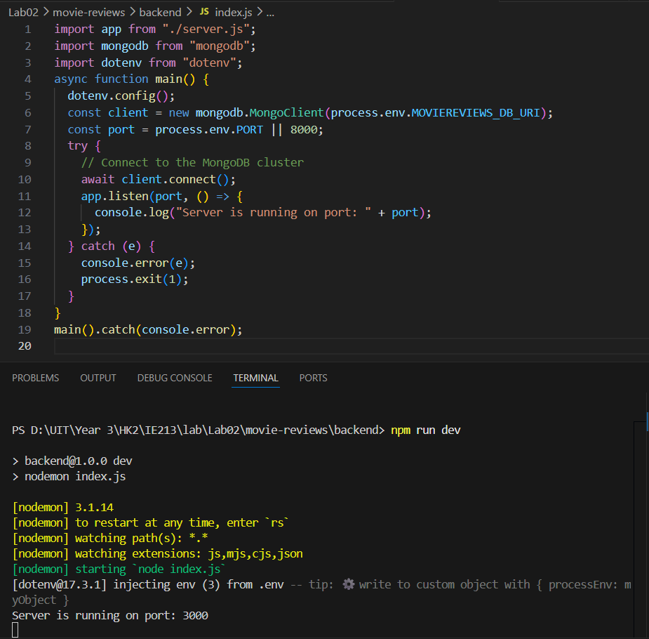

**2.4 — Tạo route `api/movies.route.js`**

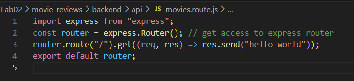

**2.4.1 — Kết quả endpoint trên browser**

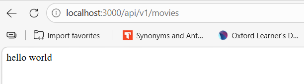

**2.5 — Thiết lập DAO `moviesDAO.js`**

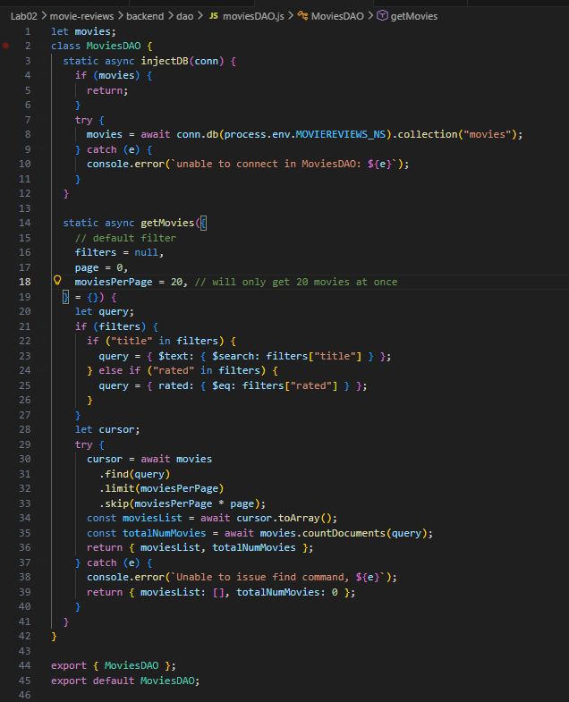

**2.5.1 — Gọi `MoviesDAO.injectDB()` trong `index.js`**

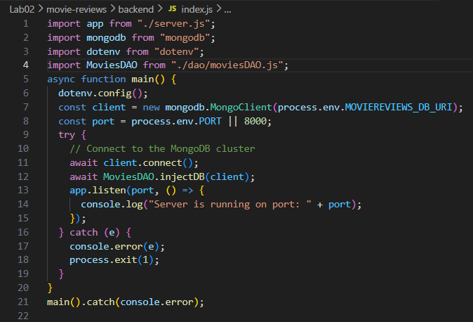

**2.6 — Thiết lập controller `movies.controller.js`**

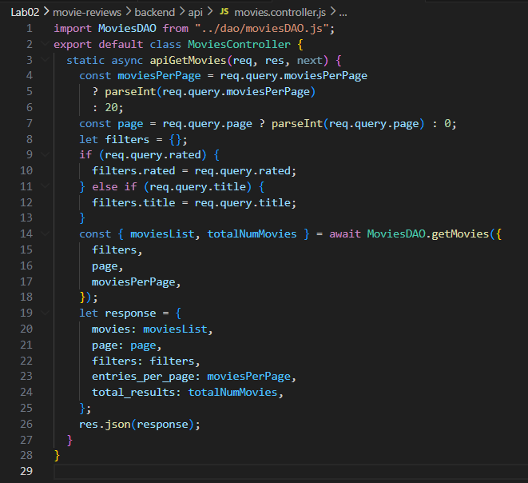

**2.7 — Đưa controller vào định tuyến**

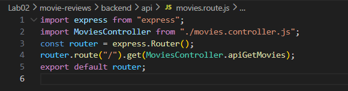

**2.8 — Kết quả cuối trên browser**


**Lab03 — Hoàn thiện Back-end cho ứng dụng minh họa**

**Mục tiêu bài thực hành**
- Hoàn thiện backend cho ứng dụng Movie Reviews theo mô hình Route -> Controller -> DAO.
- Bổ sung chức năng review CRUD, tra cứu phim theo ID kèm review và lấy danh sách rating.
- Kiểm thử toàn bộ API bằng Insomnia.

**Công cụ / môi trường sử dụng**
- Node.js và JavaScript ES6.
- Trình soạn thảo mã nguồn: Visual Studio Code.
- Thư viện chính: `express`, `cors`, `dotenv`, `mongodb`, `nodemon`.
- Cơ sở dữ liệu: MongoDB Atlas Cloud.
- Công cụ kiểm thử API: Insomnia.

**Cách chạy**
- Bước 1: Vào thư mục `Lab03/movie-reviews/backend`.
- Bước 2: Cài dependencies bằng `npm install`.
- Bước 3: Cấu hình file `.env` với `MOVIEREVIEWS_DB_URI`, `MOVIEREVIEWS_NS`, `PORT`.
- Bước 4: Chạy server bằng `npm run dev` hoặc `node index.js`.
- Bước 5: Kiểm thử các endpoint sau bằng Insomnia:
  - `GET /api/v1/movies`
  - `GET /api/v1/movies/id/:id`
  - `GET /api/v1/movies/ratings`
  - `POST /api/v1/movies/review`
  - `PUT /api/v1/movies/review`
  - `DELETE /api/v1/movies/review`

**Kết quả đầu ra**
- Backend chạy thành công trên cổng cấu hình.
- API trả được danh sách phim, phim theo ID kèm review, và danh sách rating.
- Thêm, sửa, xóa review hoạt động qua endpoint `/api/v1/movies/review`.

**Giải thích ngắn gọn phần chính đã thực hiện**
- **Routing:** Dùng `express.Router()` để định tuyến request đến đúng controller.
- **Controller:** Nhận dữ liệu từ `req.body` hoặc `req.params`, gọi DAO và trả JSON cho client.
- **DAO:** Thao tác trực tiếp với MongoDB bằng `insertOne`, `updateOne`, `deleteOne`, `aggregate` và `distinct`.
- **Tra cứu nâng cao:** Dùng `$lookup` để lấy phim kèm các review liên quan, và `distinct("rated")` để lấy danh sách rating.

**Hình ảnh minh họa kết quả**

**Bài 1 — Thiết lập định tuyến cho review**

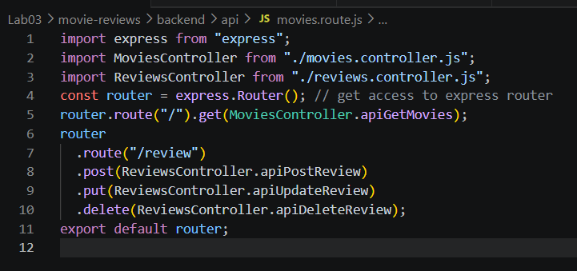

**Bài 2 — Thiết lập Controller cho review**

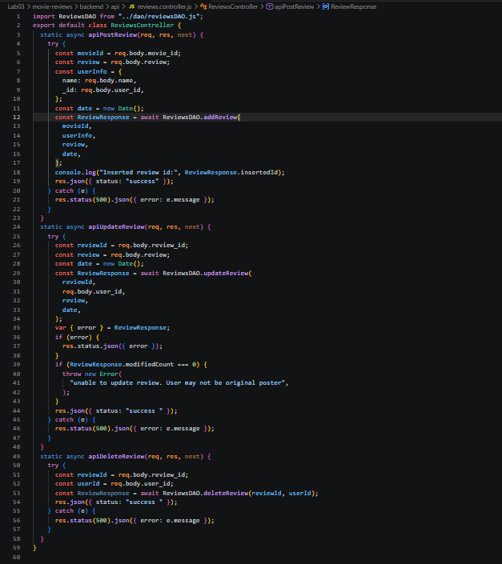

**Bài 3 — Thiết lập DAO cho reviews**

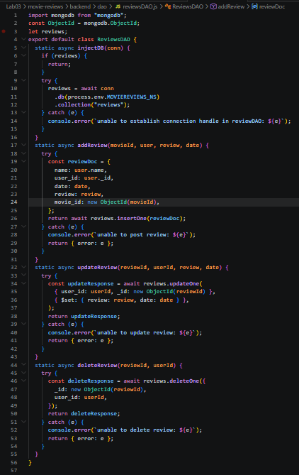

**3.6 — Thử nghiệm các API thêm / xóa / sửa dữ liệu**

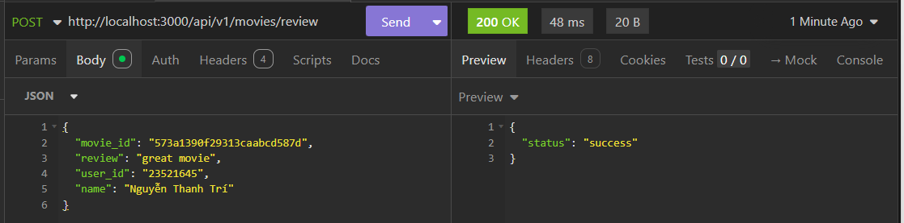

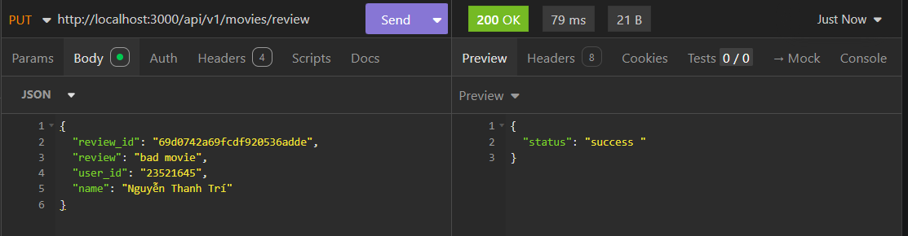

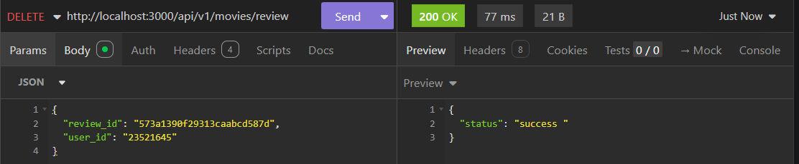

**Bài 4 — Hoàn thành back-end cho ứng dụng minh họa**

**4.1 — Thêm định tuyến lấy phim theo Id kèm review và lấy rating**

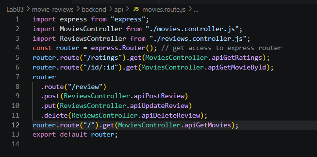

**4.2 — Thêm controller `apiGetMovieById()` và `apiGetRatings()`**

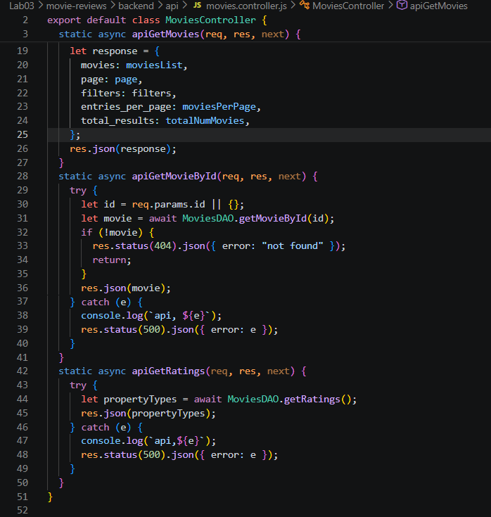

**4.3 — Thêm DAO `getMovieById()` và `getRatings()`**

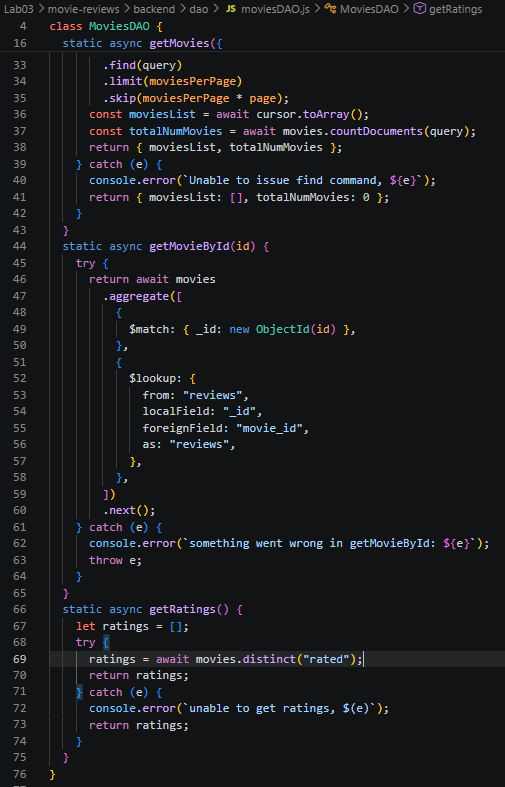

**4.4 — Thử nghiệm các API vừa tạo**

**Kết quả API: Lấy tất cả thông tin của phim và các review liên quan theo Id phim**

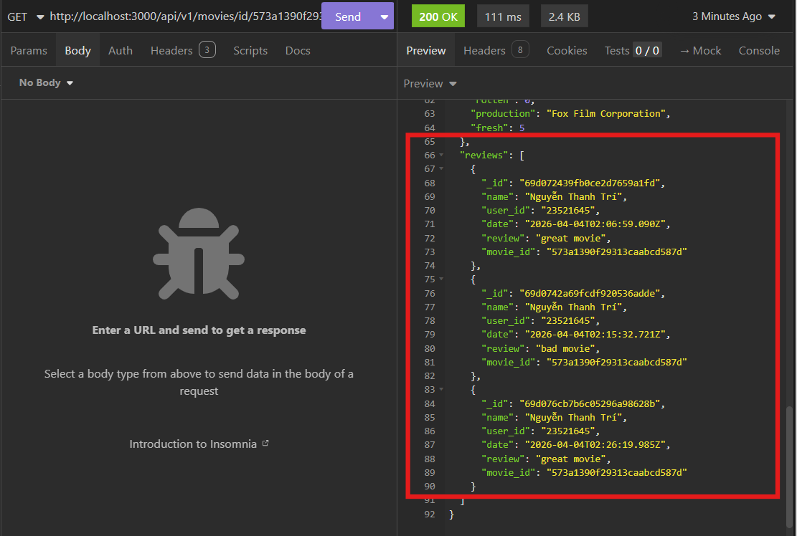

**Kết quả API: Lấy tất cả các loại rating của phim trên dữ liệu**

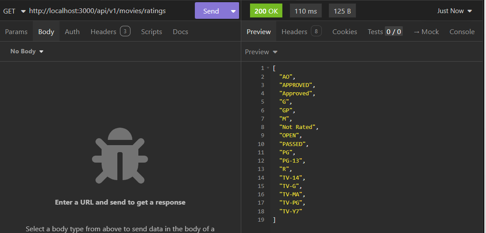

**Lab04 — Thiết lập Frontend với REACTJS**

**Mục tiêu bài thực hành**
- Thiết lập phần Frontend cho dự án ứng dụng minh họa "Movie Review" bằng ReactJS.
- Xây dựng thanh điều hướng (Navigation Header bar) cho ứng dụng.
- Thiết lập các định tuyến (routing) để kết nối các thành phần (components) trong ứng dụng.

**Công cụ / môi trường sử dụng**
- Thư viện chính: `ReactJS`.
- Công cụ khởi tạo: `create-react-app`.
- Thư viện hỗ trợ UI: `Bootstrap` và `React-Bootstrap`.
- Thư viện điều hướng: `React Router Dom` (v6+).
- Môi trường chạy: Node.js với trình quản lý gói `npm`.

**Cách chạy**
- Bước 1: Di chuyển vào thư mục `Lab04/movie-reviews/frontend`.
- Bước 2: Cài đặt các gói phụ thuộc bằng lệnh `npm install`.
- Bước 3: Khởi chạy ứng dụng bằng câu lệnh `npm start`.
- Bước 4: Mở trình duyệt tại `http://localhost:3000` để xem kết quả.

**Kết quả đầu ra**
- Ứng dụng React chạy thành công tại `localhost:3000`.
- Navbar hiển thị logo "Movie Reviews" cùng các menu chức năng.
- Chuyển đổi qua lại giữa các trang thông qua hệ thống định tuyến (Routing).

**Giải thích ngắn gọn phần chính đã thực hiện**
- **Cấu trúc Component:** Xây dựng các file `movies-list.js`, `movie.js`, `add-review.js`, `login.js` trong thư mục `Components`.
- **Giao diện chính:** Tích hợp `Navbar` từ `React-Bootstrap` vào `App.js`.
- **Định tuyến:** Sử dụng `BrowserRouter`, `Routes` và `Route` để quản lý các đường dẫn trong ứng dụng.
- **Quản lý trạng thái:** Dùng `useState` để giả lập trạng thái đăng nhập/đăng xuất của người dùng.

**Hình ảnh minh họa kết quả**

**Bài 1: Thiết lập nơi làm việc với frontend của dự án.**
1.1 Tạo template frontend với React trong thư mục Movie Review

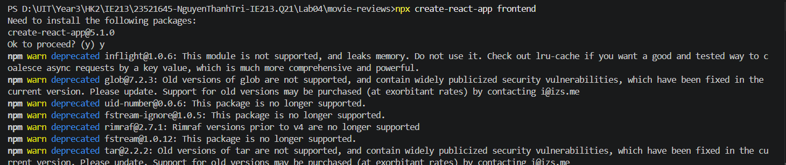

1.2 Cài đặt một số package hỗ trợ xây dựng dự án:
- Bootstrap: hỗ trợ xây dựng UI.

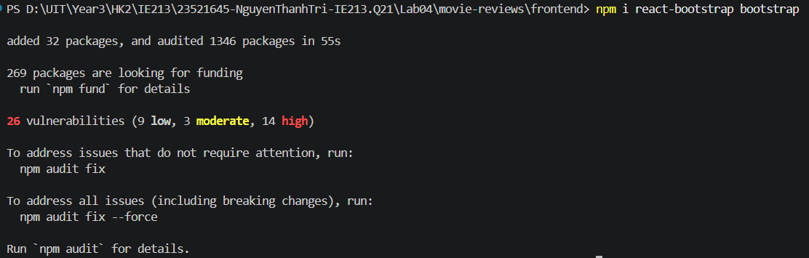

- React router dom: hỗ trợ định tuyến.

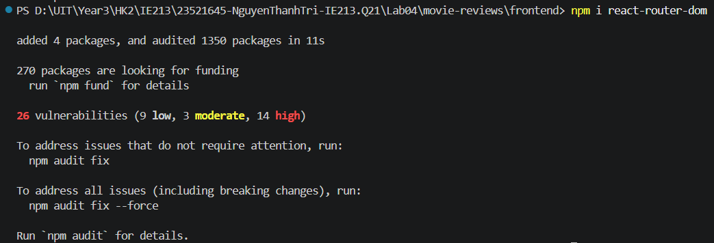

**Bài 2: Xây dựng Navigation Header bar cho ứng dụng.**
2.1 Navigation bar sẽ giúp người dùng định tuyến tới các nội dung của ứng dụng, do đó ta cần xây dựng các component như:
- `movies-list`: hiển thị thông tin danh sách phim.
- `movie`: hiển thị phim với các review.
- `add-review`: hỗ trợ thêm review cho khách.
- `login`: trang đăng nhập cho khách.
Lưu ý: các component này sẽ được tạo trong thư mục `Components` (được tạo trong thư mục `frontend`), và lần lượt import vào tệp tin `App.js` để sử dụng về sau.

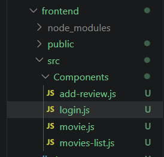

2.2 Lấy `Navbar` Component từ `React-Bootstrap` và đưa vào trong phần mã nguồn JSX của function `App()` trong tệp tin `App.js`.

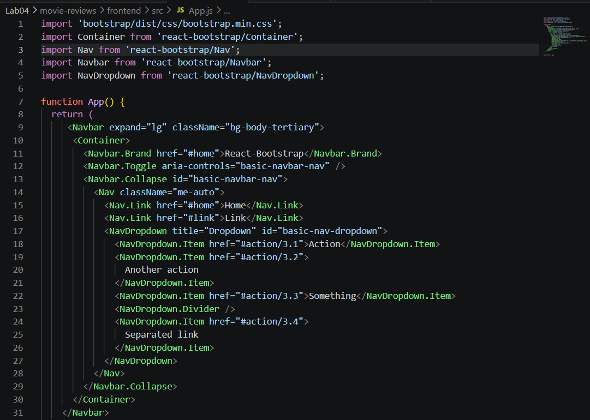

2.3 Điều chỉnh một số thông tin:
- Tên logo: **Movie Reviews**.
- Liên kết thứ nhất thay Home thành **Movies**.
- Liên kết thứ hai thay Link thành trạng thái **Login/Logout** của người dùng.

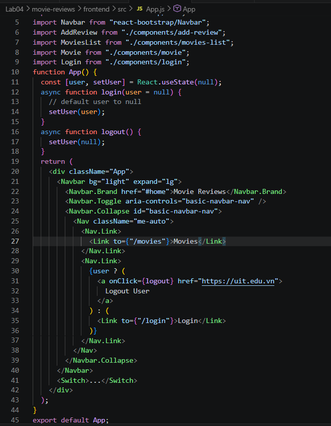

**Bài 3: Thiết lập các định tuyến cho các component vừa tạo ở trên.**
3.1 Trong tệp tin `App.js` cần sử dụng thẻ `<Routes>` (import từ `react-router-dom` v6) để định tuyến cho 4 component tạo ở bài 2.1.
3.2 Các định tuyến bao gồm:
- `/`: đến component `MoviesList`.
- `/movies/:id/review`: đến component `AddReview`.
- `/movies/:id`: đến component `Movie`.
- `/login`: đến component `Login`.

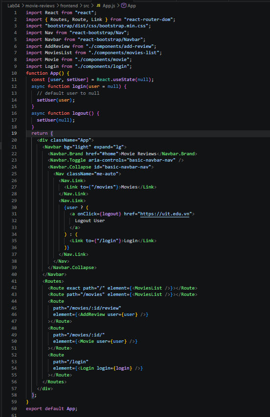


Kết quả cuối cùng

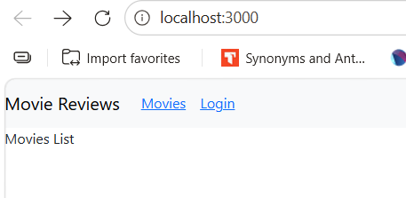

**Lab05 — Xây dựng Frontend với REACTJS**

**Mục tiêu bài thực hành**
- Xây dựng giao diện Frontend cho ứng dụng xem và đánh giá phim bằng ReactJS.
- Kết nối frontend ReactJS với backend Movie Reviews bằng thư viện `axios`.
- Xây dựng lớp dịch vụ dùng chung để gọi API từ backend một cách thống nhất.
- Hoàn thiện các Component `MoviesList` và `Movie` để hiển thị danh sách phim, chi tiết phim và danh sách review tương ứng.

**Công cụ / Môi trường sử dụng**
- Thư viện chính: `ReactJS`.
- Thư viện gọi API: `axios`.
- Thư viện UI: `Bootstrap` và `React-Bootstrap`.
- Thư viện điều hướng: `React Router Dom`.
- Thư viện định dạng thời gian: `momentjs`.
- Môi trường chạy: Node.js với trình quản lý gói `npm`.

**Cách chạy**
- **Bước 1:** Di chuyển vào thư mục `Lab05/movie-reviews/frontend`.
- **Bước 2:** Cài đặt các gói cần thiết bằng lệnh `npm install`.
- **Bước 3:** Đảm bảo Backend đang chạy (thường tại `http://localhost:5000`).
- **Bước 4:** Khởi chạy ứng dụng bằng lệnh `npm start`.
- **Bước 5:** Mở trình duyệt tại `http://localhost:3000` để kiểm tra giao diện.

**Kết quả đầu ra**
- Ứng dụng frontend React chạy thành công, kết nối mượt mà với API Backend.
- `MovieDataService` cung cấp đầy đủ các hàm gọi API: `getAll()`, `get(id)`, `createReview()`, `updateReview()`, `deleteReview()`, `getRatings()`.
- `MoviesList` hiển thị danh sách phim bằng `Card` của React-Bootstrap, hỗ trợ tìm kiếm theo tiêu đề và lọc theo rating.
- Trang chi tiết phim hiển thị đầy đủ thông tin Plot và danh sách các Review liên quan.
- Thời gian trong các review được định dạng chuyên nghiệp bằng `momentjs` (ví dụ: `18th April 2022`).

**Giải thích ngắn gọn phần chính đã thực hiện**
- **Kết nối backend:** Tạo lớp `MovieDataService` sử dụng `axios` để tập trung quản lý các lời gọi API từ frontend đến backend.
- **Quản lý trạng thái:** Sử dụng Hook `useState()` để quản lý danh sách phim, thông tin tìm kiếm và dữ liệu chi tiết của từng bộ phim.
- **Nạp dữ liệu động:** Sử dụng Hook `useEffect()` để tự động tải dữ liệu từ API khi component được khởi tạo hoặc khi có sự thay đổi trạng thái tìm kiếm.
- **Xử lý hiển thị:** Dùng các component của `React-Bootstrap` như `Card`, `Button`, `Form` để xây dựng giao diện hiện đại và đáp ứng.
- **Định dạng dữ liệu:** Sử dụng `momentjs` để chuyển đổi định dạng ngày tháng từ API sang định dạng dễ đọc cho người dùng.

**Hình ảnh minh họa kết quả**

**Bài 1: Kết nối tới Backend và Xây dựng MovieDataService**

1.1 Cài đặt thư viện `axios` và khởi tạo instance kết nối với Backend URL.

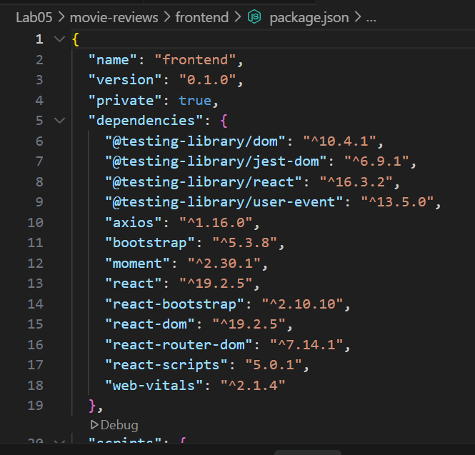

1.2 Xây dựng lớp dịch vụ `MovieDataService` trong `src/services/movies.js` để định nghĩa các phương thức gọi API.

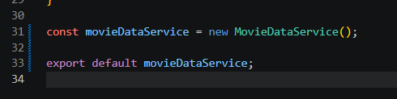

1.3 Tạo các lời gọi dịch vụ tới backend, sử dụng axios để gọi bao gồm: `getAll()`, `get(id)`, `createReview(data)`, `updateReview(data)`, `deleteReview(data)`, `getRatings()`.

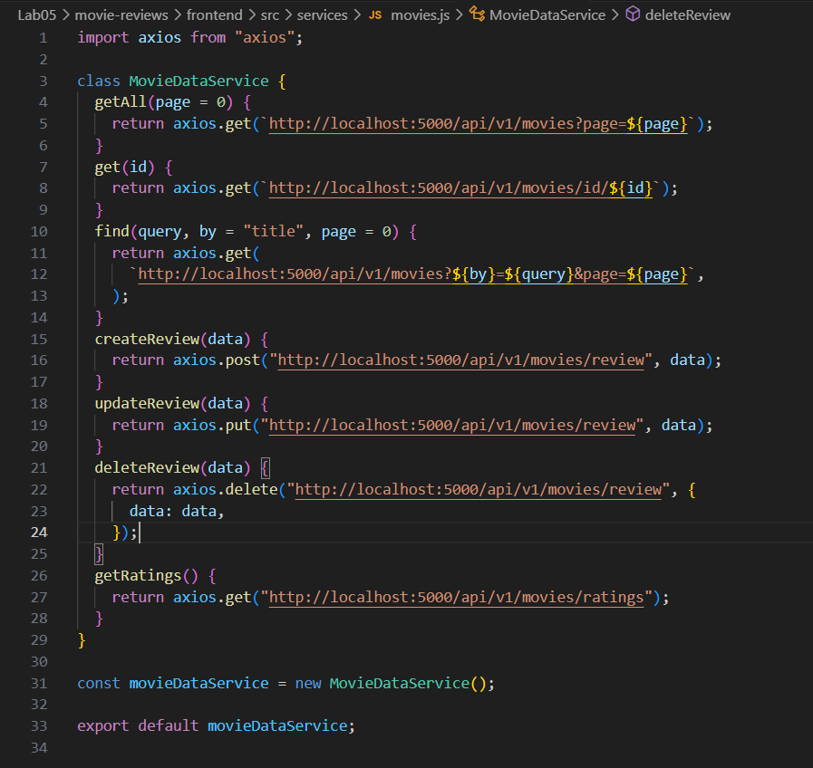

**Bài 2: Xây dựng MoviesList Component**

2.1 Khai báo các biến trạng thái `movies`, `searchTitle`, `searchRating`, `ratings` bằng `useState()`.

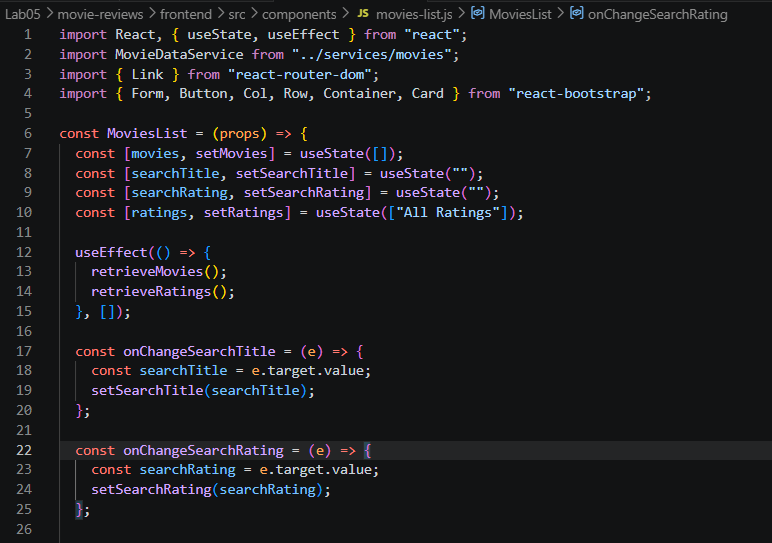

2.2 Xây dựng các hàm `retrieveMovies()` và `retrieveRatings()` để nạp dữ liệu ban đầu thông qua `useEffect()`.

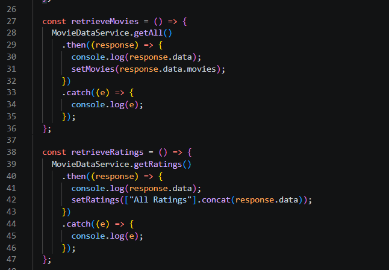

2.3 Thiết kế giao diện tìm kiếm gồm trường nhập Title và danh sách chọn Rating.

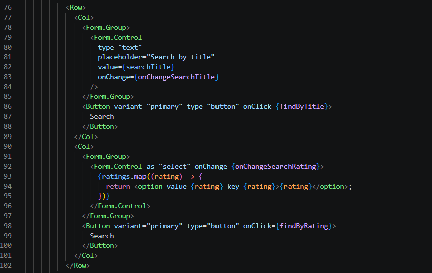

2.4 Hiển thị danh sách phim dưới dạng các `Card` với hình ảnh, tiêu đề và nút xem review.

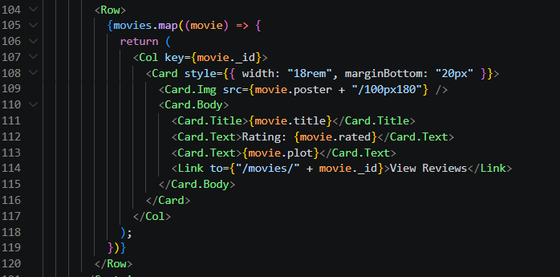

2.5 Hiện thực logic tìm kiếm phim theo Title và Rating.

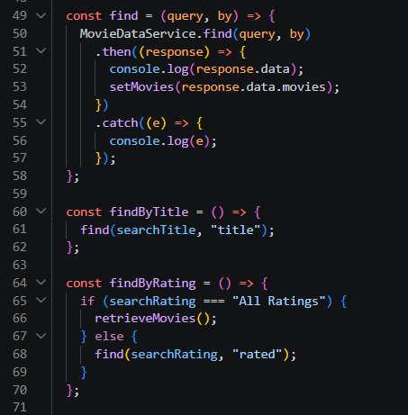

*Kết quả giao diện trang chủ danh sách phim:*

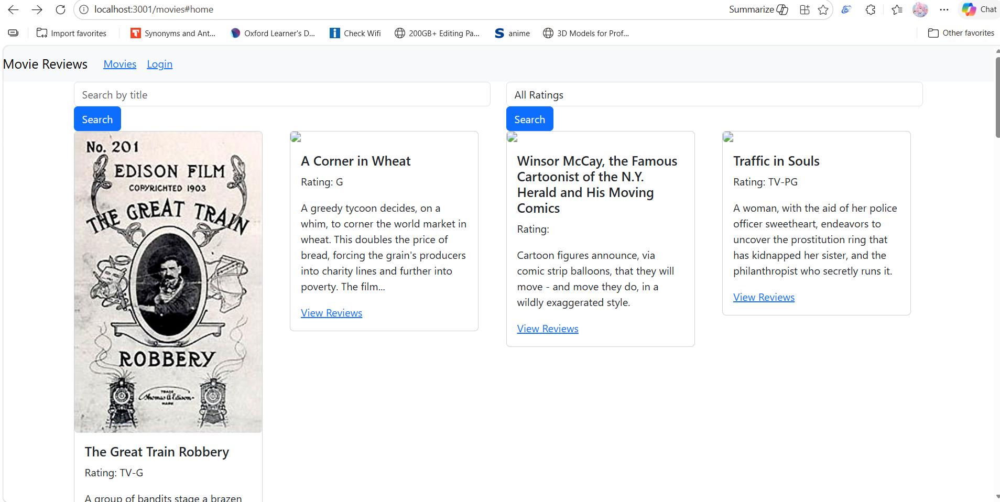

**Bài 3: Hiển thị thông tin trang movie khi nhấn vào `View Reviews`**

3.1 Thiết lập mã nguồn cho component Movie trong tệp tin ./components/movie.js gồm các biến trạng thái movie để lưu trữ thông tin chi tiết của movie như id, title, rated, reviews.

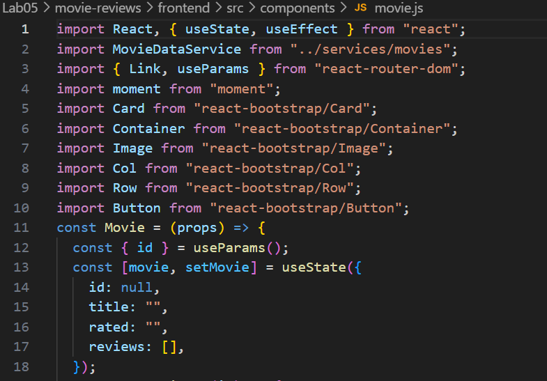

3.2 Xây dựng mã nguồn cho phương thức getMovie() trong component này để gọi phương thức get() trong MovieDataService.

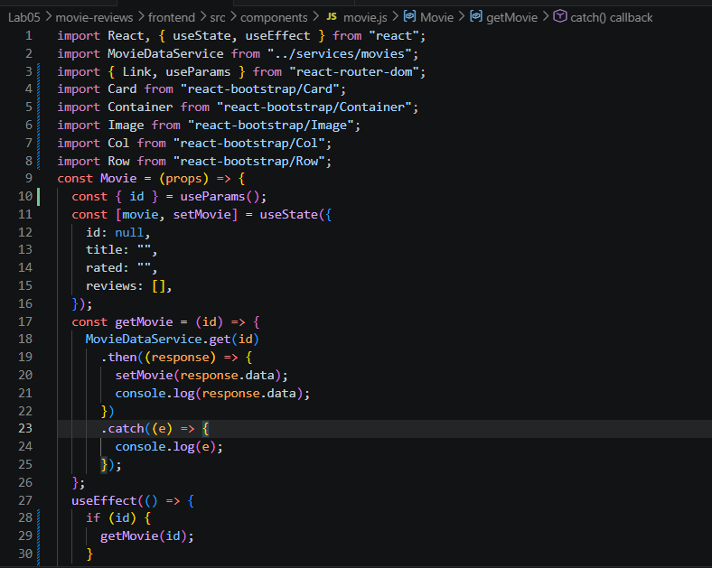

*Kết quả giao diện trang chi tiết phim:*

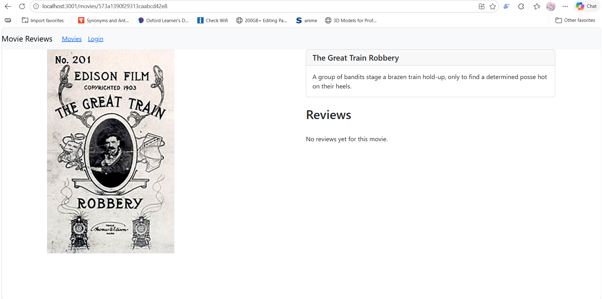

**Bài 4: Hiển thị danh sách Review và định dạng thời gian**

4.1 Viết đoạn mã nguồn JSX để duyệt qua danh sách review và hiển thị từng phản hồi của người dùng.

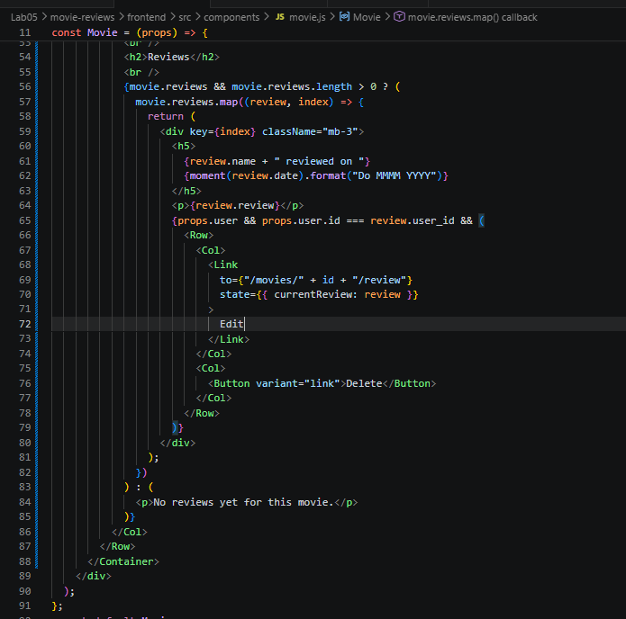

4.2 Sử dụng thư viện `momentjs` để định dạng lại ngày tháng đánh giá (`Do MMMM YYYY`).

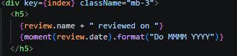

*Kết quả hiển thị danh sách review:*

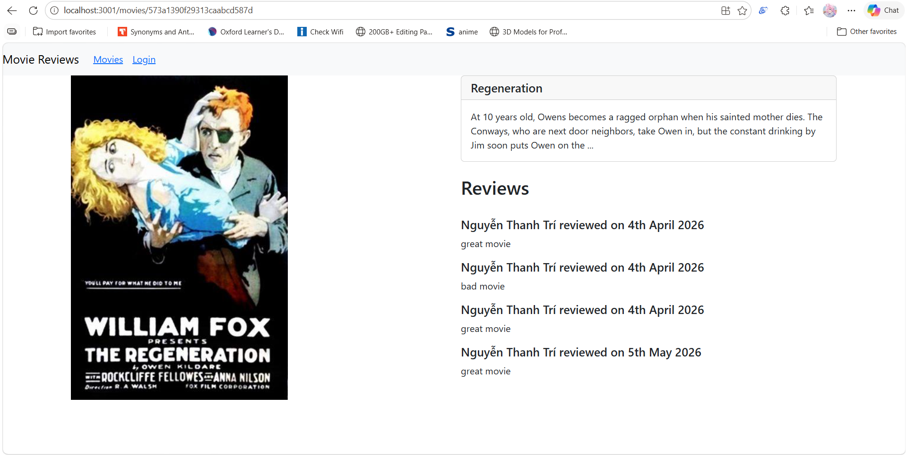

**Những nội dung đã hoàn thành & chưa hoàn thành**
- Hoàn thành: Lab01, Lab02, Lab03, Lab04, Lab05.
- Chưa hoàn thành: Lab06.

**Sử dụng công cụ AI**
Các công cụ AI được sử dụng trong quá trình soạn thảo và hoàn thiện tài liệu này:

- **GitHub Copilot**
  - Mục đích sử dụng: Hỗ trợ chỉnh sửa code, đề xuất cách cấu trúc lại thư mục, và gợi ý đổi tên/đường dẫn ảnh khi di chuyển file.
  - Phần được AI hỗ trợ: Chỉnh sửa/sắp xếp `images` `README.md`, tối ưu cấu trúc thư mục, sửa đường dẫn ảnh và tên file hình ảnh cho rõ nghĩa.

- **Gemini**
  - Mục đích sử dụng: Tra cứu tài liệu, tham khảo cú pháp MongoDB, Node.js, xây dựng testcase và giải thích lỗi khi chạy lệnh.
  - Phần được AI hỗ trợ: Đối chiếu cú pháp lệnh MongoDB, soạn testcase kiểm thử, phân tích nguyên nhân lỗi và đề xuất hướng khắc phục.
